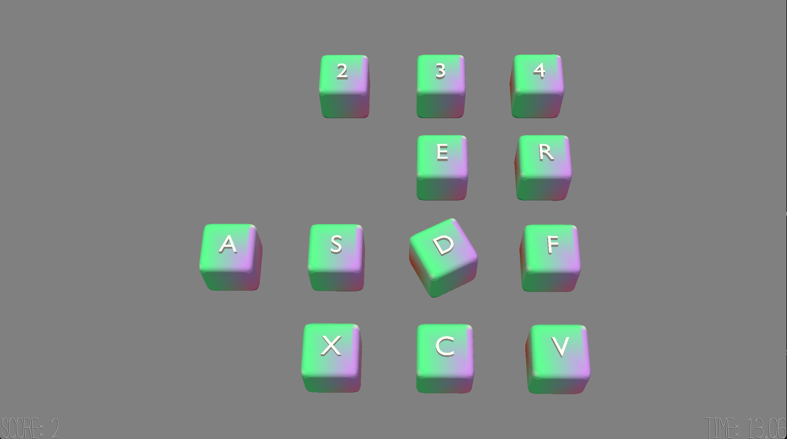

# Sound Matching Game

Author: Kavya Tummalapalli

Design: What is new and interesting about my game as this is a matching game not with visuals but with sounds. Also, the longer you take, the more difficult it gets to play the game as the clashing background music makes the sounds harder to differentiate.

Screen Shot:

How To Play:

Press the keys labeled on the blocks (1,2,3,4,q,w,e,r,a,s,d,f,z,x,c,v(all lowercase)) to match the sounds. The more turns you take, the louder the background music gets, making listening and matching more challenging. Match all 8 pairs of blocks before the time runs out to win!

This game was built with [NEST](NEST.md).
